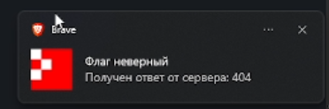
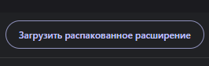

# Расширение для отображения результатов сдачи флага в T-Поколении

## Введение

[Check demo](assets/tbank_demo.mp4)

Расширение показывает результат сдачи флага в уведомлении

## Установка

1) Включить режим разработчика в расширениях 

1) Выбрать папку с исходным кодом расширения

